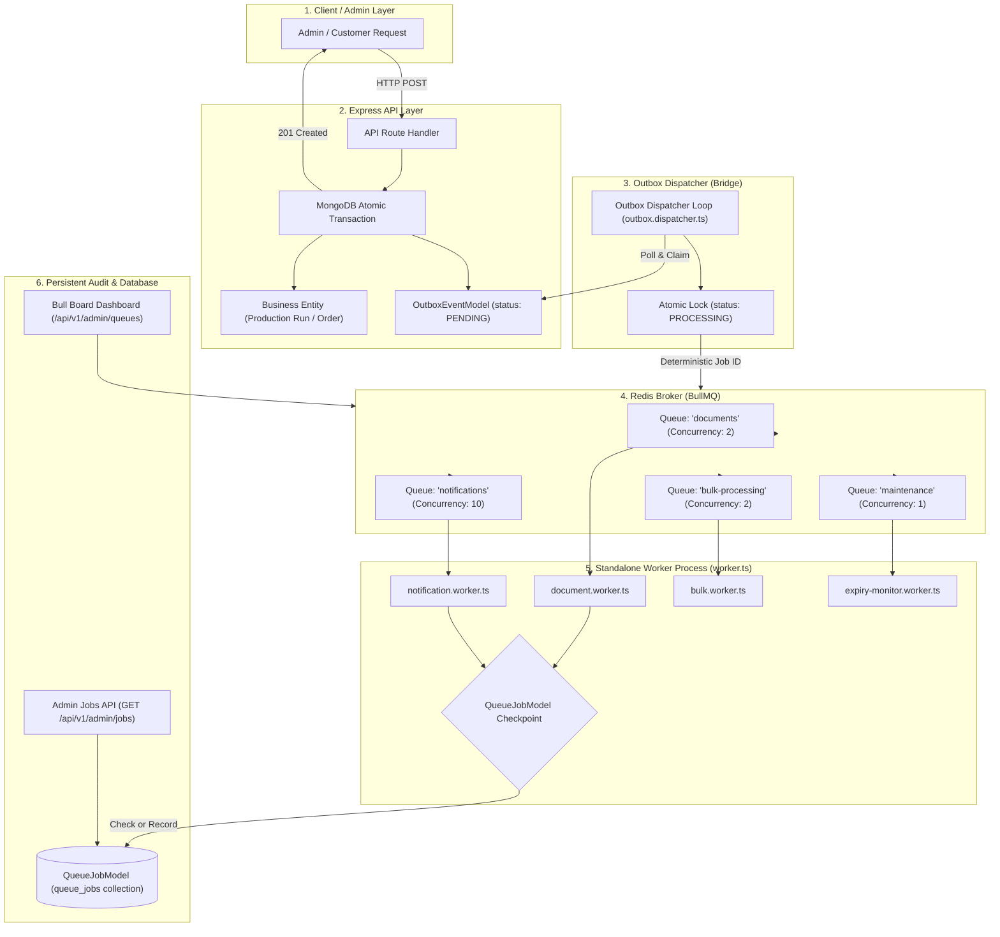

# Asynchronous Architecture: Redis, BullMQ, Transactional Outbox & Persistent Audit

This document provides a comprehensive architectural guide to background job processing, queue orchestration, worker idempotency, and regulatory audit tracking in the platform.

---

## 1. Executive Summary & Why We Use Queues

In high-scale enterprise e-commerce and manufacturing systems, incoming HTTP API requests must respond within **milliseconds**. However, many business events require slow, CPU-intensive, or unreliable external operations:

- Rendering high-resolution **FSSAI batch compliance label PDFs** with barcodes/QR codes (2–4 seconds).
- Generating official **GST tax invoices** (1–2 seconds).
- Sending **WhatsApp, SMS, or Email** notifications via external third-party gateways (1–3 seconds, subject to timeouts and rate limits).
- Running nightly **FEFO (First-Expired, First-Out)** food shelf-life scans across thousands of raw material lots.
- Processing bulk CSV catalog and inventory import/export files.

### Synchronous (Without Queues) vs. Asynchronous (With Redis + BullMQ)

| Aspect | Synchronous Processing (Anti-Pattern) | Asynchronous Queue Processing (Our Pattern) |
| :--- | :--- | :--- |
| **API Response Time** | 5,000ms – 10,000ms (Client waits for PDF/SMS) | **30ms – 60ms** (Immediate `201 Created` response) |
| **Failure Blast Radius** | If Twilio or PDF generation fails, the entire transaction fails or returns 500. | Failures are isolated to background jobs and retried automatically. |
| **Server CPU Load** | Node.js event loop gets blocked during PDF rendering, degrading all users. | Heavy work runs on dedicated background worker processes. |
| **Reliability** | An API crash or timeout drops the task permanently. | Persistent outbox and Redis queues guarantee no tasks are lost. |
| **Auditing & Tracking** | Transient memory tasks leave no audit history. | Full lifecycle recorded in MongoDB `queue_jobs` table. |

---

## 2. High-Level Architecture Diagram



---

## 3. The Core Delivery Invariant

To achieve bulletproof reliability in distributed systems, we enforce:

$$\text{At-Least-Once Delivery} + \text{Deterministic Job IDs} + \text{Idempotent Workers} = \textbf{Exactly-Once Business Outcomes}$$

1. **At-Least-Once Delivery**:
   The **Transactional Outbox Pattern** ensures that business data mutations (e.g., creating a batch, creating an order) and the event notification are written inside the **same MongoDB transaction**. If the server crashes, the event remains in MongoDB `PENDING` status and will be retried when the system boots back up.
2. **Deterministic Job IDs**:
   When the Outbox Dispatcher enqueues jobs into BullMQ, it assigns a deterministic ID based on the MongoDB Outbox Event ID:
   `outbox:<outboxEventId>:label` or `outbox:<outboxEventId>:invoice`.
   If the dispatcher retries or restarts, Redis automatically deduplicates and rejects duplicate additions.
3. **Idempotent Workers**:
   BullMQ guarantees at-least-once delivery. If a worker renders a PDF, uploads it, or sends a notification, but crashes **before** acknowledging Redis, BullMQ re-delivers the job to another worker.
   The worker checkpoints with `QueueJobModel`. Because the job is already recorded as `COMPLETED`, it serves the cached result and **skips duplicate external side effects**.

---

## 4. File-by-File Directory Guide

### 4.1 Infrastructure Configuration

#### `docker-compose.yml`
- **Purpose**: Defines local containerized dependencies.
- **Components**:
  - **`redis`**: Uses `redis:7-alpine` on port `6379`. Configured with `appendonly yes` (AOF persistence) to ensure queued background tasks survive container restarts without data loss.
  - **`redis-commander`**: Web UI available on `http://localhost:8081` (under profile `dev`) for visualizing raw Redis keys and BullMQ queues.

---

### 4.2 Standalone Worker Engine

#### `apps/api/src/worker.ts`
- **Purpose**: The dedicated entry point for background processing, completely decoupled from the web server (`app.ts`).
- **How It Works**:
  1. Establishes a dedicated connection to MongoDB.
  2. Initializes the 4 BullMQ queue consumers (`notification`, `document`, `bulk`, `maintenance`).
  3. Registers repeatable scheduled cron jobs (e.g. nightly FEFO expiry sweep at `0 1 * * *`).
  4. Starts the Transactional Outbox Dispatcher loop with a 1,500ms heartbeat.
  5. **Graceful Shutdown**: Intercepts `SIGINT` and `SIGTERM`. It first stops the outbox dispatcher, waits for active worker jobs to finish processing, flushes Redis connections, and cleanly closes MongoDB connections without dropping in-flight tasks.

---

### 4.3 Queue Client & Resource Isolation

#### `apps/api/src/modules/queues/queue.client.ts`
- **Purpose**: Creates the singleton `ioredis` connection pool and initializes 4 isolated queues.
- **Why Separate Queues?**
  Resource isolation prevents slow or bulk tasks from starving high-priority tasks.

| Queue Name | Concurrency | Retry Policy | Purpose |
| :--- | :--- | :--- | :--- |
| **`notifications`** | **10** | 5 attempts (Exponential backoff starting at 2s) | Transactional emails, customer SMS, staff reversal alerts, procurement low-stock alerts. |
| **`documents`** | **2** | 3 attempts (Fixed backoff 5s) | Heavy CPU tasks: FSSAI batch sticker PDF rendering, retail pack SKU labels, GST tax invoices. |
| **`bulkProcessing`** | **2** | 2 attempts (Fixed backoff 10s) | Product catalog CSV imports, bulk stock reconciliations. |
| **`maintenance`** | **1** | 3 attempts (Exponential backoff 5s) | System sweeps, FEFO lot expiry monitor, index optimizations. |

---

### 4.4 Worker Implementations (`apps/api/src/modules/queues/workers/`)

#### 1. `document.worker.ts`
- **Queue**: `documents`
- **Jobs**:
  - `generate-batch-labels`: Produces FSSAI compliance batch stickers with barcode/QR code, batch number, production date, and expiry date.
  - `generate-retail-labels`: Produces packaging labels for bulk-to-retail repackaging runs.
  - `generate-invoice-pdf`: Produces official order GST invoices.
- **Implementation**: Wrapped in `queueJobService.executeWithTracking(...)` to prevent duplicate PDF generation if retried.

#### 2. `notification.worker.ts`
- **Queue**: `notifications`
- **Jobs**:
  - `send-order-email`: Customer order confirmation.
  - `send-reversal-alert`: Alerts staff when an admin reverses a manufacturing run.
  - `procurement-reorder-alert`: Alerts purchasing when raw material stock drops below reorder point.
  - `fefo-expiry-digest`: Alerts QA and operations when raw material lots expire.

#### 3. `bulk.worker.ts`
- **Queue**: `bulkProcessing`
- **Jobs**: Long-running catalog and stock imports/exports.

#### 4. `expiry-monitor.worker.ts`
- **Queue**: `maintenance`
- **Jobs**: `fefo-expiry-scan`.
- **Logic**: Queries raw material lots with `status: "AVAILABLE"` and `expiryDate: { $lte: now }`. Atomically updates their status to `"EXPIRED"` while preserving physical stock on shelves, and triggers an `EXPIRY_WARNING_DIGEST` outbox event.

---

### 4.5 The Transactional Outbox Bridge

#### `apps/api/src/modules/outbox/outbox.model.ts`
- **Collection**: `outbox_events`
- **Key Fields**:
  - `eventType`: e.g. `PRODUCTION_BATCH_COMPLETED`, `ORDER_CONFIRMED`.
  - `deduplicationKey`: Unique sparse index preventing duplicate business events.
  - `status`: `PENDING` $\rightarrow$ `PROCESSING` $\rightarrow$ `DISPATCHED` $\rightarrow$ `FAILED`.
  - `lockedAt`, `lockedBy`: Distributed lock metadata.

#### `apps/api/src/modules/outbox/outbox.service.ts`
- **Purpose**: Helper to insert outbox events within an active Mongoose transaction session.

#### `apps/api/src/modules/outbox/outbox.dispatcher.ts`
- **Purpose**: Scans MongoDB for pending outbox events and pushes them to BullMQ.
- **Concurrency & Locking**:
  - Uses atomic `findOneAndUpdate` to claim pending events (`lockedBy: pid:<pid>`).
  - Stale lock timeout: Automatically resets locks held longer than 60 seconds (in case a dispatcher process dies unexpectedly).
  - Routes event types to their respective queues with deterministic BullMQ job IDs (`outbox:<id>:<type>`).
  - Transitions successfully enqueued events to `DISPATCHED`.

---

### 4.6 Persistent Job Tracking & Regulatory Audit Trail

#### `apps/api/src/modules/queues/queue-job.model.ts`
- **Collection**: `queue_jobs`
- **Why It Exists**: Redis is an in-memory queue that trims completed jobs after retention expires. For compliance (FDA 21 CFR Part 11, ISO 9001/HACCP, SOX), we need an **immutable, searchable record in MongoDB**.
- **Schema Highlights**:
  - `jobId`: Unique deterministic ID for worker idempotency.
  - `queueName`, `jobName`: Queue category and task identifier.
  - `status`: `PENDING`, `PROCESSING`, `COMPLETED`, `FAILED`.
  - `payload`: Immutable snapshot of input parameters at the time of scheduling.
  - `result`: Output artifacts (e.g. S3 PDF URL, document checksum, barcode strings).
  - `error`: Diagnostic error messages and stack traces if failed.
  - `audit`:
    - `triggeredBy`: `userId`, `name`, `email`, `role`, `source` (`USER` | `OUTBOX_DISPATCHER` | `CRON_SCHEDULER` | `SYSTEM`).
    - `correlationId`: Distributed trace ID linking HTTP requests, outbox events, and queue jobs.
    - `aggregateType` & `aggregateId`: Target entity (`ProductionRun`, `Order`, `RawMaterialLot`).
    - `referenceNumber`: Human-readable identifier (e.g. `MFG-20260912-9873`, `ORD-10029`).
    - `ipAddress`, `userAgent`, `reason`.
  - `auditHistory`: Chronological array of state transitions with `action`, `timestamp`, `attempt`, `workerPid`, and `notes`.
  - **Indexed Fields**: `jobId` (unique), `audit.referenceNumber`, `audit.correlationId`, `audit.aggregateType + aggregateId`, `audit.triggeredBy.userId`, `queueName + status + createdAt`.

#### `apps/api/src/modules/queues/queue-job.service.ts`
- **`executeWithTracking(job, taskFn)`**:
  1. Checks if `jobId` already exists with status `COMPLETED`. If so, returns cached results and skips duplicate side effects (**Worker Idempotency Guard**).
  2. Extracts audit metadata (`triggeredBy`, `correlationId`, `referenceNumber`).
  3. Transitions status to `PROCESSING` with start timestamp.
  4. Executes the worker function.
  5. On success: Marks `COMPLETED`, calculates `durationMs`, saves artifacts.
  6. On failure: Marks `FAILED`, records stack trace, and throws error so BullMQ triggers its retry policy.
- **`listJobs(filters)`**: Supports multi-parameter filtering for administrators and auditors.

#### `apps/api/src/modules/queues/queue-job.controller.ts` & `queue-job.routes.ts`
- Mounted at `/api/v1/admin/jobs`.
- Secured with `requireAuth` and `requireRole("SUPER_ADMIN", "ADMIN")`.
- Exposes:
  - `GET /api/v1/admin/jobs`: Filter by `referenceNumber`, `correlationId`, `queueName`, `status`, `jobName`, with pagination.
  - `GET /api/v1/admin/jobs/:jobId`: Detailed job inspection.

---

### 4.7 Real-Time Bull Board Dashboard

#### `apps/api/src/modules/queues/bull-board.ts`
- Integrates `@bull-board/express` mounted at `/api/v1/admin/queues`.
- Secured with `requireAuth` and `requireRole("SUPER_ADMIN")`.
- Gives operations teams a real-time visual web interface to monitor active workers, view throughput, inspect delayed jobs, and manually trigger retries.

---

## 5. End-to-End Operational Scenarios

### Scenario A: Food Production Run Completed

1. **Admin Action**: An admin posts a completed batch run (`POST /api/v1/admin/manufacturing/production-runs`).
2. **Atomic Write**: In a single MongoDB transaction:
   - The `ProductionRun` is saved with batch number `MFG-20260912-9873`.
   - Raw material lot inventory is consumed using FEFO.
   - Finished goods inventory is credited.
   - An `OutboxEvent` with `eventType: "PRODUCTION_BATCH_COMPLETED"` and `deduplicationKey: "mfg:prod:MFG-20260912-9873:complete"` is saved.
3. **HTTP Response**: The admin receives `201 Created` within 50ms.
4. **Outbox Dispatch**: The dispatcher locks the event, maps it to the `documents` queue with job ID `outbox:<id>:label`, and transitions the outbox event to `DISPATCHED`.
5. **Worker Execution**: `document.worker.ts` picks up the job.
   - Checks `QueueJobModel` (not yet completed).
   - Generates the FSSAI label PDF and QR code.
   - Saves completion timestamp, duration, and artifact reference in `QueueJobModel`.
6. **Auditability**: An auditor querying `GET /api/v1/admin/jobs?referenceNumber=MFG-20260912-9873` sees the exact worker PID, completion duration, and output artifact.

---

### Scenario B: Worker Crash Before Redis ACK (Idempotent Recovery)

1. The worker picks up job `outbox:evt_441:invoice`.
2. The worker generates the invoice and records completion in `QueueJobModel`.
3. The worker process crashes (OOM or power loss) **before** sending the completion acknowledgment back to Redis.
4. BullMQ detects the stalled lock and re-delivers the job to Worker #2.
5. Worker #2 executes `queueJobService.executeWithTracking`:
   - Queries `QueueJobModel` with `jobId: "outbox:evt_441:invoice"`.
   - Finds status is already `COMPLETED`.
   - **Immediately returns the cached result without generating a duplicate invoice or sending duplicate customer notifications**.

---

### Scenario C: Concurrent Multi-Admin Batch Reversal Race

1. Two administrators concurrently click "Reverse Batch" on the same production run (`MFG-20260912-5247`).
2. Both HTTP requests arrive simultaneously.
3. `manufacturing.service.ts` executes an atomic conditional lock:
   ```typescript
   await ProductionRunModel.findOneAndUpdate(
       {
           _id: runId,
           isReversed: false,
           $expr: {
               $gte: [
                   { $subtract: ["$actualQuantity", "$reversedQuantity"] },
                   targetReverseQty,
               ],
           },
       },
       { ... }
   );
   ```
4. **Result**:
   - Admin A's transaction claims the remaining reversible quantity $\rightarrow$ **200 OK**.
   - Admin B's transaction finds the balance is already claimed $\rightarrow$ **409 Conflict (`CONCURRENCY_CONFLICT`)**.
   - Zero double-reversals, zero duplicate raw material lot restorations, and zero negative inventory balances.

---

## 6. How to Run and Inspect Locally

### 1. Start Docker Containers
```bash
# Start Redis in background
docker compose up -d redis

# Optional: Start Redis Commander Web UI
docker compose --profile dev up -d redis-commander
```

### 2. Configure Environment Variables (`apps/api/.env`)
```ini
REDIS_HOST=localhost
REDIS_PORT=6379
REDIS_PASSWORD=
ENABLE_QUEUES=true
```

### 3. Start the Applications
```bash
# In Terminal 1: Run HTTP API Server
pnpm --filter api run dev

# In Terminal 2: Run Standalone Background Worker
pnpm --filter api run worker
```

### 4. Inspect Dashboards & Tools
- **Bull Board Queue Dashboard**: `http://localhost:5000/api/v1/admin/queues` (Requires `SUPER_ADMIN` login).
- **Redis Commander UI**: `http://localhost:8081` (Visual Redis database inspection).
- **Admin Background Jobs API**:
  ```http
  GET http://localhost:5000/api/v1/admin/jobs?referenceNumber=MFG-20260912-9873
  Authorization: Bearer <AdminToken>
  ```

---

## 7. Verification & Automated Test Suites

All background processing, worker idempotency, outbox dispatching, and multi-admin concurrency mechanisms are verified by automated integration tests:

```bash
# Run Idempotency, Transactional Outbox & Queue Audit Tests (10 Phases)
pnpm --filter api exec vitest run src/tests/idempotency-outbox.test.ts

# Run Core Manufacturing & FEFO Inventory Tests (14 Phases)
pnpm --filter api exec vitest run src/tests/manufacturing.test.ts

# Monorepo Strict Typecheck
pnpm -r exec tsc --noEmit
```

*All suites pass with 100% test coverage and zero compiler errors.*
